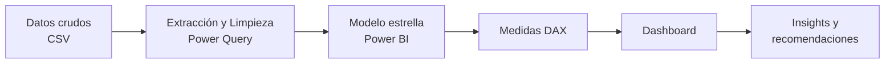
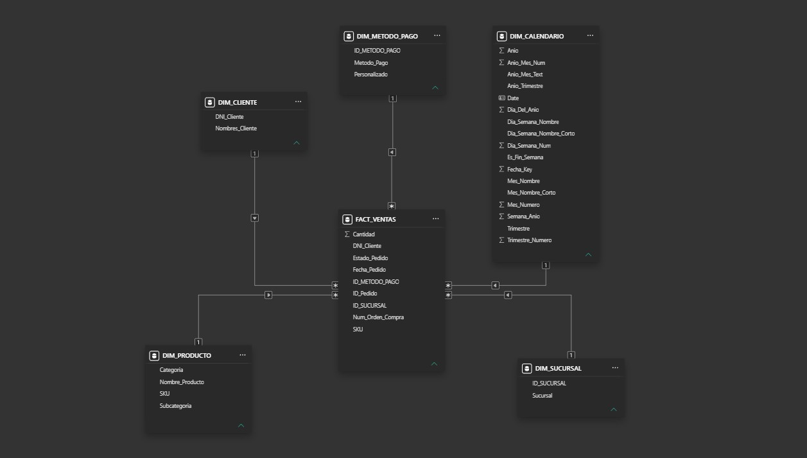

# 🛒·Análisis de E-commerce de punta a punta

> **Resumen en una frase:** Analicé [X] pedidos de [empresa/dataset] entre [año] y [año] para identificar [problema] y recomendar [acción], lo que podría [impacto estimado, ej. reducir 12% los retrasos de entrega].

- Ejemplo: "Analicé 100 mil pedidos de Olist (Brasil, 2016-2018) para entender por qué cae la satisfacción del cliente y recomendar mejoras logísticas que podrían reducir 15% las malas reseñas." 

## 🔗 Enlaces rápidos

| 📊 Dashboard | 🎥 Video (2-3 min) |
|---|---|
| [Ver Dashboard Interactivo](URL) | [Ver Video Resumen](URL) |


<!-- Un GIF del dashboard en uso también funciona muy bien aquí. -->

---

## 1. Problema de negocio

**Contexto:** [2-3 líneas: quién es la empresa, qué vende, qué situación enfrenta.]

**Preguntas que quería responder:**
1. ¿[Pregunta 1, ej. cómo evolucionan las ventas mes a mes y qué categorías las impulsan]?
2. ¿[Pregunta 2, ej. qué regiones tienen más retrasos en entrega]?
3. ¿[Pregunta 3, ej. cuál es la relación entre tiempo de entrega y satisfacción]?
4. ¿[Pregunta 4, ej. qué segmento de clientes es más valioso]?

---

## 2. Hallazgos principales

<!-- Llena esta sección AL FINAL, pero déjala arriba: es lo que más lee el reclutador. Siempre con números. -->

- 📈 **[Hallazgo 1]:** [dato concreto, ej. las ventas crecieron 45% en Q4, impulsadas por 3 categorías].
- 🚚 **[Hallazgo 2]:** [dato concreto, ej. los pedidos con más de 10 días de entrega reciben 2.3x más reseñas negativas].
- 👥 **[Hallazgo 3]:** [dato concreto, ej. solo 3% de clientes recompra, hay oportunidad de retención].

---

## 3. Flujo del proyecto



---

## 4. Datos

- **Fuente:** [nombre y enlace, ej. Brazilian E-Commerce Public Dataset by Olist, Kaggle]
- **Periodo:** [fechas]
- **Tamaño:** [X filas, Y tablas]
- **Tablas principales:** `orders`, `order_items`, `customers`, `products`, `payments`, `reviews`, [...]

> ⚠️ Si el dataset es muy pesado, sube solo una muestra en `/data` y deja el enlace al original.

---

## 5. Proceso paso a paso

### 5.1 Limpieza con Power Query

| Problema | Solución aplicada |
|---|---|
| Fechas en 4 formatos distintos como texto | Cambio de tipo a fecha con configuración regional |
| Precios con texto (`S/`, `S.`) mezclado con números | Columna personalizada: `Text.Remove` de letras/símbolos + `Text.Trim` |
| Método de pago con variantes (`YAPE`, `yap`, `Tarje credito`, `Efectivoo`) | Columna condicional con `Text.Contains` para normalizar a 5 valores estándar |
| Sucursal con nombres parciales (`anita`, `civico`, `Polvos Azu`) | Columna condicional con `Text.Contains` para normalizar a 4 sucursales |
| Columnas originales sucias | Eliminadas y reemplazadas por sus versiones limpias, luego renombradas |
| Tipos de datos finales | `Precio_Unitario` y `Cantidad` a entero, resto de columnas verificadas |

<details>
<summary>Ver código M completo (Power Query)</summary>

```m
let
    Origen = Csv.Document(File.Contents("ventas_ecommerce.csv"),[Delimiter=",", Columns=14, Encoding=1252, QuoteStyle=QuoteStyle.None]),
    #"Encabezados promovidos" = Table.PromoteHeaders(Origen, [PromoteAllScalars=true]),
    #"Tipo cambiado" = Table.TransformColumnTypes(#"Encabezados promovidos",{{"Fecha_Pedido", type date}}),
    #"Filas ordenadas" = Table.Sort(#"Tipo cambiado",{{"Fecha_Pedido", Order.Ascending}}),
    #"Texto en mayúsculas" = Table.TransformColumns(#"Filas ordenadas",{{"Estado_Pedido", Text.Upper, type text}, {"Sucursal", Text.Upper, type text}, {"Metodo_Pago", Text.Upper, type text}, {"Producto", Text.Upper, type text}, {"Subcategoria", Text.Upper, type text}, {"Categoria", Text.Upper, type text}, {"Nombres_Cliente", Text.Upper, type text}}),
    #"Personalizada agregada" = Table.AddColumn(#"Texto en mayúsculas", "Precio_Limpio", each let
        limpieza_base = Text.Remove([Precio_Unitario], {"a".."z", "A".."Z", "/", "."}),
        limpieza_espacios = Text.Trim(limpieza_base)
    in
        limpieza_espacios),
    #"Personalizada agregada1" = Table.AddColumn(#"Personalizada agregada", "Metodo_Pago_Limpio", each if Text.Contains([Metodo_Pago], "EFECT") or Text.Contains([Metodo_Pago], "EFECTIVOO") then "EFECTIVO"
        else if Text.Contains([Metodo_Pago], "YAP") then "YAPE"
        else if Text.Contains([Metodo_Pago], "TARJE CREDITO") or Text.Contains([Metodo_Pago], "TARJETA CREDITO") or Text.Contains([Metodo_Pago], "CREDITO") then "TARJETA DE CREDITO"
        else if Text.Contains([Metodo_Pago], "DEBITO") then "TARJETA DE DEBITO"
        else if Text.Contains([Metodo_Pago], "PLIN") then "PLIN"
        else "REVISAR METODO"),
    #"Personalizada agregada2" = Table.AddColumn(#"Personalizada agregada1", "Sucursal_Limpia", each if Text.Contains([Sucursal], "ROSADO") then "POLVOS ROSADOS"
        else if Text.Contains([Sucursal], "AZULES") or Text.Contains([Sucursal], "AZU") then "POLVOS AZULES"
        else if Text.Contains([Sucursal], "ANITA") or Text.Contains([Sucursal], "SANTA ANITA") or Text.Contains([Sucursal], "MALL") then "MALL SANTA ANITA"
        else if Text.Contains([Sucursal], "CIVICO") or Text.Contains([Sucursal], "REALPLAZA") then "REAL PLAZA CENTRO CIVICO"
        else "REVISAR SUCURSAL"),
    #"Columnas quitadas" = Table.RemoveColumns(#"Personalizada agregada2",{"Precio_Unitario", "Metodo_Pago", "Sucursal"}),
    #"Columnas con nombre cambiado" = Table.RenameColumns(#"Columnas quitadas",{{"Producto", "Nombre_Producto"}, {"Precio_Limpio", "Precio_Unitario"}, {"Metodo_Pago_Limpio", "Metodo_Pago"}, {"Sucursal_Limpia", "Sucursal"}}),
    #"Tipo cambiado1" = Table.TransformColumnTypes(#"Columnas con nombre cambiado",{{"Sucursal", type text}, {"Metodo_Pago", type text}, {"Precio_Unitario", Int64.Type}, {"Cantidad", Int64.Type}})
in
    #"Tipo cambiado1"
```

</details>

### 5.2 Modelo estrella ⭐



| Tipo | Tabla | Descripción | Clave |
|---|---|---|---|
| **Hechos** | `FACT_VENTAS` | Una fila por producto vendido en cada pedido | `ID_PEDIDO`, `product_id` |
| Dimensión | `DIM_CLIENTES` | Datos del cliente | `DNI` |
| Dimensión | `DIM_PRODUCTOS` | Producto, categoria y subcategoria | `SKU` |
| Dimensión | `DIM_METODO_PAGO` | Datos del metodo pago | `ID_METODO_PAGO` |
| Dimensión | `DIM_SUCURSAL` | Datos de la sucursal | `ID_SUCURSAL` |
| Dimensión | `DIM_CALENDARIO` | Fechas, mes, trimestre, año | `DATE` |

**Relaciones:** todas de uno a muchos (1:*), con filtro en una sola dirección desde las dimensiones hacia la tabla de hechos.

**Decisiones de modelado:** creé una tabla calendario propia para usar funciones de inteligencia de tiempo.

### 5.3 Medidas DAX 🧮

Documentación completa en [`docs/medidas_dax.md`](docs/medidas_dax.md).

| Medida | Fórmula | Qué mide |
|---|---|---|
| Ventas Totales | `SUM(fact_ventas[precio])` | Ingresos totales |
| Pedidos | `DISTINCTCOUNT(fact_ventas[order_id])` | Número de pedidos únicos |
| Ticket Promedio | `DIVIDE([Ventas Totales], [Pedidos])` | Gasto promedio por pedido |
| Ventas Año Anterior | `CALCULATE([Ventas Totales], SAMEPERIODLASTYEAR(dim_calendario[fecha]))` | Ventas del mismo periodo del año pasado |
| % Crecimiento YoY | `DIVIDE([Ventas Totales] - [Ventas Año Anterior], [Ventas Año Anterior])` | Variación anual |
| [Tu medida] | `[fórmula]` | [descripción] |

### 5.4 Dashboard 📊

**Página 1: Resumen ejecutivo** · KPIs, tendencia de ventas, top categorías


**Página 2: [Logística / Clientes / Producto]** · [qué muestra]


**Interactividad:** [segmentadores por fecha y región, drill-through, tooltips personalizados, etc.]

---

## 6. Recomendaciones de negocio

1. **[Recomendación 1]:** [acción concreta + impacto esperado].
2. **[Recomendación 2]:** [acción concreta + impacto esperado].
3. **[Recomendación 3]:** [acción concreta + impacto esperado].

---

## 7. Limitaciones y próximos pasos

- [Limitación, ej. los datos no incluyen costos, así que no se puede calcular margen.]
- [Próximo paso, ej. automatizar la actualización con un pipeline en Python.]
- [Próximo paso, ej. agregar un modelo de predicción de ventas.]

---
