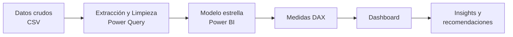
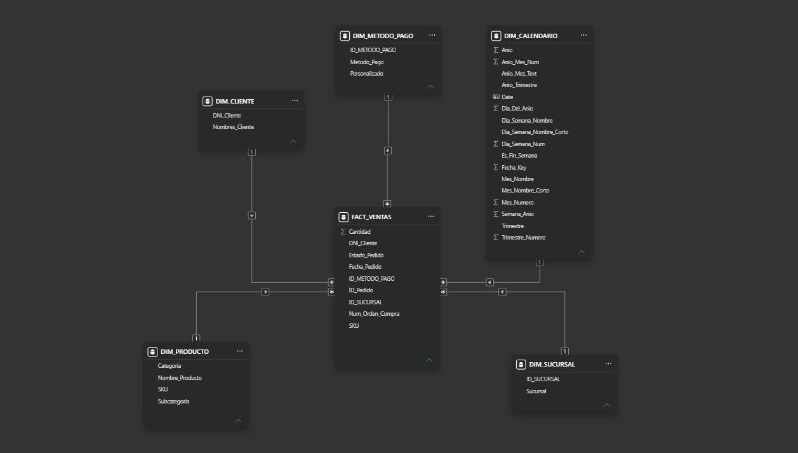

# ·GT Gaming Store - Análisis de Ventas de un E-commerce 

> **Resumen:** Analicé 5,432 líneas de pedido de 3,786 órdenes de una tienda de e-commerce y retail gaming peruana entre 2024 y 2025 para identificar la causa detrás de la caída de ventas en una de sus 4 sucursales, y recomendar acciones que podrían recuperar hasta S/ 106,946 en ventas perdidas por cancelación.

> ⚠️ **Nota sobre los datos:** Este proyecto está inspirado en una experiencia laboral real en el sector retail/e-commerce gaming. Por motivos de confidencialidad, todos los datos utilizados (precios, nombres de clientes, cifras de ventas, DNI) son **sintéticos**, generados para fines de portafolio. La estructura del negocio (categorías de producto, dinámica de sucursales, tipo de problemas operativos) refleja patrones reales del sector, pero ningún dato específico de la empresa original fue utilizado ni expuesto.

## 🔗 Enlaces rápidos

| 📊 Dashboard | 🎥 Video (2-3 min) |
|---|---|
| [Ver Dashboard Interactivo](URL) | [Ver Video Resumen](URL) |


---

## 1. Problema de negocio

**Contexto:**  Este proyecto está inspirado en mi experiencia trabajando para una empresa peruana de retail y e-commerce dedicada a la venta de productos gaming con presencia en 4 puntos de venta en Lima. Por motivos de confidencialidad, los datos reales de la empresa no pueden ser utilizados ni publicados: el dataset de este repositorio es sintético, construido a partir de la misma estructura de negocio (categorías de producto, dinámica de sucursales, comportamiento de compra), pero con cifras, precios, clientes y transacciones generados artificialmente.

**Preguntas que quería responder:**
1. ¿Qué sucursal genera más ventas totales y cuál menos?
2. ¿La diferencia es marginal o hay una brecha grande?
3. ¿Coincide la sucursal líder en ventas con la que tiene más órdenes, o vende menos órdenes pero de mayor valor?
4. ¿Qué categoría tiene el ticket promedio más alto por línea?}
5. ¿Qué categoría mueve más volumen pero factura menos?
6. ¿Qué % de clientes compró más de una vez?
7. ¿Ese grupo de clientes recurrentes representa una porción desproporcionada de las ventas?
8. ¿Qué % total de pedidos se cancela?
9. ¿La tasa de cancelación es pareja entre sucursales, o alguna se aleja del resto?
10. ¿Las cancelaciones se concentran en alguna categoría en particular?

---

## 2. Hallazgos principales


- **La Caída oculta en Mall Santa Anita** aunque el acumulado del 2024 y 2025 la muestra es solo de 4 puntos por debajo de la líder, al desagregar por año se identificó una caída sostenida durante 2025 de S/ 47 mil en diciembre del 2024 a un mínimo de S/ 9 mil en septiembre del 2025, causada por un incremento en cancelaciones de 5.6% → 9.4% concentrado en la categoría Consolas con el 18.8% de cancelación, mientras el resto de la red mejoraba su tasa en el mismo periodo.
- **Las Consolas concentran el valor, mientras que Accesorios concentra el volumen.** Consolas tiene el ticket promedio más alto de S/ 2,098, es 6 veces mas que el de Videojuegos y genera 46% de la facturación total, mientras Accesorios es la categoría de mayor rotación de 3,527 unidades con el ticket más bajo, confirmando que el negocio depende fuertemente de una sola categoría para sus ingresos.
- **El 36% de los clientes genera el 63.5% de las ventas.** los clientes recurrentes que realizaron 2+ compras representan poco más de un tercio de la base, pero casi dos tercios de la facturación, evidencia de que la fidelización tiene un retorno desproporcionado frente a la adquisición de nuevos clientes.

---

## 3. Flujo del proyecto


```mermaid
flowchart LR
    A[Datos crudos<br/>CSV] --> B[Extracción y Limpieza<br/>Power Query]
    B --> C[Modelo estrella<br/>Power BI]
    C --> D[Medidas DAX]
    D --> E[Dashboard]
    E --> F[Insights y<br/>recomendaciones]
```

---


## 4. Proceso paso a paso

### 4.1 Limpieza con Power Query

| Problema | Solución aplicada |
|---|---|
| Fechas en 4 formatos distintos como texto | Cambio de tipo a fecha con configuración regional |
| Precios con texto (`S/`, `S.`) mezclado con números | Columna personalizada: `Text.Remove` de letras/símbolos + `Text.Trim` |
| Método de pago con variantes (`YAPE`, `yap`, `Tarje credito`, `Efectivoo`) | Columna condicional con `Text.Contains` para normalizar a 5 valores estándar |
| Sucursal con nombres parciales (`anita`, `civico`, `Polvos Azu`) | Columna condicional con `Text.Contains` para normalizar a 4 sucursales |
| Columnas originales sucias | Eliminadas y reemplazadas por sus versiones limpias, luego renombradas |
| Tipos de datos finales | `Precio_Unitario` y `Cantidad` a entero, resto de columnas verificadas |

<details>
<summary>Ver código M completo (Power Query)</summary>

```m
let
    Origen = Csv.Document(File.Contents("ventas_ecommerce.csv"),[Delimiter=",", Columns=14, Encoding=1252, QuoteStyle=QuoteStyle.None]),
    #"Encabezados promovidos" = Table.PromoteHeaders(Origen, [PromoteAllScalars=true]),
    #"Tipo cambiado" = Table.TransformColumnTypes(#"Encabezados promovidos",{{"Fecha_Pedido", type date}}),
    #"Filas ordenadas" = Table.Sort(#"Tipo cambiado",{{"Fecha_Pedido", Order.Ascending}}),
    #"Texto en mayúsculas" = Table.TransformColumns(#"Filas ordenadas",{{"Estado_Pedido", Text.Upper, type text}, {"Sucursal", Text.Upper, type text}, {"Metodo_Pago", Text.Upper, type text}, {"Producto", Text.Upper, type text}, {"Subcategoria", Text.Upper, type text}, {"Categoria", Text.Upper, type text}, {"Nombres_Cliente", Text.Upper, type text}}),
    #"Personalizada agregada" = Table.AddColumn(#"Texto en mayúsculas", "Precio_Limpio", each let
        limpieza_base = Text.Remove([Precio_Unitario], {"a".."z", "A".."Z", "/", "."}),
        limpieza_espacios = Text.Trim(limpieza_base)
    in
        limpieza_espacios),
    #"Personalizada agregada1" = Table.AddColumn(#"Personalizada agregada", "Metodo_Pago_Limpio", each if Text.Contains([Metodo_Pago], "EFECT") or Text.Contains([Metodo_Pago], "EFECTIVOO") then "EFECTIVO"
        else if Text.Contains([Metodo_Pago], "YAP") then "YAPE"
        else if Text.Contains([Metodo_Pago], "TARJE CREDITO") or Text.Contains([Metodo_Pago], "TARJETA CREDITO") or Text.Contains([Metodo_Pago], "CREDITO") then "TARJETA DE CREDITO"
        else if Text.Contains([Metodo_Pago], "DEBITO") then "TARJETA DE DEBITO"
        else if Text.Contains([Metodo_Pago], "PLIN") then "PLIN"
        else "REVISAR METODO"),
    #"Personalizada agregada2" = Table.AddColumn(#"Personalizada agregada1", "Sucursal_Limpia", each if Text.Contains([Sucursal], "ROSADO") then "POLVOS ROSADOS"
        else if Text.Contains([Sucursal], "AZULES") or Text.Contains([Sucursal], "AZU") then "POLVOS AZULES"
        else if Text.Contains([Sucursal], "ANITA") or Text.Contains([Sucursal], "SANTA ANITA") or Text.Contains([Sucursal], "MALL") then "MALL SANTA ANITA"
        else if Text.Contains([Sucursal], "CIVICO") or Text.Contains([Sucursal], "REALPLAZA") then "REAL PLAZA CENTRO CIVICO"
        else "REVISAR SUCURSAL"),
    #"Columnas quitadas" = Table.RemoveColumns(#"Personalizada agregada2",{"Precio_Unitario", "Metodo_Pago", "Sucursal"}),
    #"Columnas con nombre cambiado" = Table.RenameColumns(#"Columnas quitadas",{{"Producto", "Nombre_Producto"}, {"Precio_Limpio", "Precio_Unitario"}, {"Metodo_Pago_Limpio", "Metodo_Pago"}, {"Sucursal_Limpia", "Sucursal"}}),
    #"Tipo cambiado1" = Table.TransformColumnTypes(#"Columnas con nombre cambiado",{{"Sucursal", type text}, {"Metodo_Pago", type text}, {"Precio_Unitario", Int64.Type}, {"Cantidad", Int64.Type}})
in
    #"Tipo cambiado1"
```

</details>

### 4.2 Modelo estrella



| Tipo | Tabla | Descripción | Clave |
|---|---|---|---|
| **Hechos** | `FACT_VENTAS` | Una fila por producto vendido en cada pedido | `ID_PEDIDO`, `SKU`, `DNI`, `ID_METODO_PAGO`, `ID_SUCURSAL` |
| Dimensión | `DIM_CLIENTE` | DNI y nombres del cliente | `DNI` |
| Dimensión | `DIM_PRODUCTO` | Producto, categoría y subcategoría | `SKU` |
| Dimensión | `DIM_METODO_PAGO` | Métodos de pago normalizados | `ID_METODO_PAGO` |
| Dimensión | `DIM_SUCURSAL` | Las 4 sucursales | `ID_SUCURSAL` |
| Dimensión | `DIM_CALENDARIO` | Fechas, mes, trimestre, año | `Date` |

**Relaciones:** todas de uno a muchos (1:*), con filtro en una sola dirección desde las dimensiones hacia la tabla de hechos.

**Decisiones de modelado:** creé una tabla calendario propia para usar funciones de inteligencia de tiempo y una tabla medidas DAX para ser organizado y no tener sueltas las medidas por todas las tablas.

### 4.3 Medidas DAX

Documentación completa de las 24 medidas del modelo en [`docs/medidas_dax.md`](docs/medidas_dax.md).

| Medida | Fórmula | Qué mide |
|---|---|---|
| Total Ventas | `CALCULATE(SUMX(FACT_VENTAS, FACT_VENTAS[Cantidad] * FACT_VENTAS[Precio_Unitario]), FACT_VENTAS[Estado_Pedido] = "ENTREGADO")` | Ingresos totales, excluyendo pedidos cancelados |
| Ticket Promedio | `DIVIDE([Total Ventas], [Total Ordenes])` | Gasto promedio por orden de compra |
| % Cancelacion | `DIVIDE([Ordenes Canceladas], [Ordenes Totales (Todas)], 0)` | Proporción de órdenes canceladas sobre el total |
| % Ventas por categoria | `DIVIDE([Total Ventas], CALCULATE([Total Ventas], ALL(DIM_PRODUCTO[Categoria])), 0)` | Participación de cada categoría dentro de un contexto (ej. por sucursal) |
| Clientes Recurrentes | `COUNTROWS(FILTER(VALUES(DIM_CLIENTE[DNI_Cliente]), CALCULATE(DISTINCTCOUNT(FACT_VENTAS[Num_Orden_Compra]), FACT_VENTAS[Estado_Pedido] = "ENTREGADO") > 1))` | Clientes con 2 o más compras entregadas |
| Variacion Ventas MSA | `DIVIDE([Ventas 2025 MSA] - [Ventas 2024 MSA], [Ventas 2024 MSA], 0)` | Variación % de ventas de Mall Santa Anita, año contra año |

### 4.4 Dashboard

**Página 1: Resumen Ejecutivo** · KPIs generales (Ventas, Ticket Promedio, Órdenes, % Cancelación), tendencia de ventas mensual por sucursal (2024-2025), ranking de sucursales y distribución de ventas por categoría.


**Página 2: Sucursal y Categoría** · Mix de categorías por sucursal, ticket promedio comparado entre sucursales y entre categorías, Top 5 productos por ventas y por unidades vendidas.


**Página 3: Clientes y Métodos de Pago** · Segmentación de clientes (recurrentes vs. compra única) y su peso en las ventas totales, distribución de métodos de pago por sucursal.


**Página 4: Caso Mall Santa Anita** · Análisis dedicado al hallazgo principal del proyecto: evolución de ventas y cancelaciones 2024 vs. 2025 en esta sucursal frente al promedio de la red, y desglose de cancelaciones por categoría para identificar la causa raíz.


**Interactividad:** segmentadores de Año, Mes y Sucursal sincronizados entre las 4 páginas (excepto en la página "Caso Mall Santa Anita", donde la sucursal queda fija para mantener el foco del análisis), navegación mediante barra lateral con botones.

---

## 5. Recomendaciones de negocio


1. Auditar el proceso de gestión de inventario de Consolas en Mall Santa Anita. La tasa de cancelación de Consolas en esta sucursal es 18.8% casi duplica el promedio de la red, y coincide con una caída sostenida de ventas durante 2025 de S/ 47 mil en diciembre 2024 a un mínimo de S/ 9 mil en septiembre 2025. Un patrón común en negocios con venta online y recojo en tienda es que el catálogo no se desactiva en tiempo real cuando el stock físico llega a cero, por lo que se aceptan y cobran pedidos que luego no se pueden cumplir dentro de la ventana de despacho, terminando en cancelación y devolución. Se recomienda auditar la sincronización entre inventario físico y catálogo online para esa sucursal, desactivando automáticamente productos sin stock disponible. Corregirlo podría recuperar hasta S/ 106,946 en ventas hoy perdidas por cancelación y revertir la caída sostenida que arrastra la sucursal desde inicios de 2025.

2. Lanzar una campaña de reactivación con cupón de segunda compra. Los clientes de compra única representan el 64% de la base, pero solo el 36% de las ventas, menos de la mitad del valor promedio de un cliente recurrente. Se recomienda enviarles por correo o mensaje de WhatsApp, usando los datos de contacto ya capturados en su primera compra. Un cupón de 10% o 15% de descuento en Accesorios o Videojuegos, válido por 30 días desde el envío. Elegir categorías de ticket bajo reduce el costo del incentivo por cliente, mientras que el plazo corto genera urgencia para convertir la segunda compra antes de que el cliente pierda interés.

3. Ofrecer descuento cruzado en accesorios al comprar Consolas o Sillas. Accesorios es la categoría de mayor rotación con 3,527 unidades vendidas pero con el ticket promedio más bajo de S/ 341, mientras que Consolas y Sillas concentran el mayor valor por transacción. Se recomienda que, al comprar una Consola o Silla, el cliente reciba automáticamente un 15% de descuento en un accesorio asociado, por ejemplo un control adicional al comprar una consola, o un set de parlantes al comprar una silla gamer, aplicado en el mismo carrito de compra. Esto aumenta el ticket promedio de la transacción principal sin necesidad de atraer tráfico nuevo, aprovechando una compra que el cliente ya decidió hacer.


---

